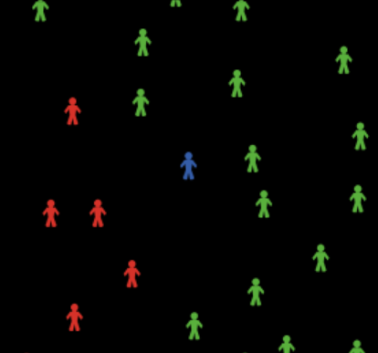
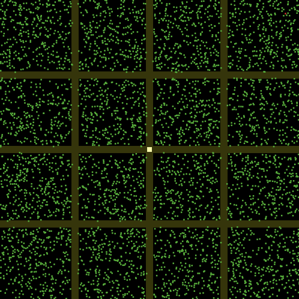
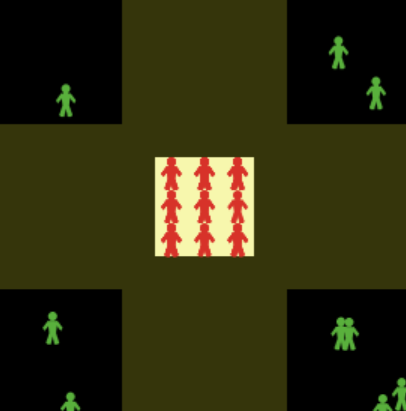

# Agent-Based Epidemiological Simulation 
This project aims to determine and quantify the effects of implementing lockdown, mass testing, quarantine delays, and social distancing in controlling the spread of the disease. In particular, we focus on the effects of these interventions to the recovery and death rates. 

### What is Agent-Based Modelling?

Agent-based modelling (ABM) is a technique that models a complex system by reducing it to the interactions between agents and their environment. Here, agents can possess properties such as age and gender, and can perform actions based on pre-defined set of conditions. The environment possesses properties as well, and can affect the behavior of agents and vice versa. Obervables such as population growth can then be measured to infer relationships between agent behavior and the overall behavior of the system. This makes ABMs powerful in that it can be used to observe and quantify the macroscopic behavior of many complex systems over time just by knowing how individual agents behave. This can be achieved without the need to construct differential equations that requires pre-existing knowledge of the relationships between observables. 

Currently, there are a number of platforms that provide users with tools needed to build an ABM simulation. For this project, we'll be using Netlogo. 

### Why Netlogo?
Netlogo is an open source, cross-platform multi-agent programmable modeling environment. Its user-friendly language allows users to quickly draft prototypes and visualize the results through an interactive customizable interface. In addition, Netlogo also includes dozens of pre-built models ranging from tumor growth simulation, to modelling behavior of gas particles. For more information, visit the official Netlogo site: https://ccl.northwestern.edu/netlogo/.

## Getting Started
### Install Netlogo
Download the latest version using the following link: https://ccl.northwestern.edu/netlogo/download.shtml. When unpacked, a folder containing all the necessary files will be created. Open the Netlogo application file to launch. 

### Clone Repository
After cloning the repository, load `epi_model.nlogo` from the file tab. Alternatively, you can simply double-click `epi_model.nlogo` from the repository folder.  

### Setup and Go Procedures
Move the sliders in the interface tab to modify hyperparameters to their desired values, then click `Setup` button to initiate and update changes to the model. Click `Go` button to run the simulation. 

## Modelling 
### Agent Behavior

Agents are allowed to move around the world, infect other agents, recover, or die from the disease depending on the its current properties and surrounding environment. Agents can either be in the following states: `susceptible`, `infected`, `recovered`, or `dead`. To differentiate one state from the other, agents that are `suscetible`, `infected`, or `recovered` are colored green, red, and blue, respectively. The exception would be when an agent is considered `dead`, in which case the agent is removed from the simulation entirely. 

At each tick, agents are allowed to move in a random direction. If a susceptible agent is near an infected agent, the latter has a probability of being infected equal to its susceptibility. Here, susceptibility is an agent-level parameter that is used to model a person's hygiene, where a higher `susceptibility` value corresponds to lower hygenic behavior. On the other hand, if an infected agent has been sick for more than or equal to its `recovery-time`, it has a probability of recovering equal to its `recovery-rate`. However, at each tick, an infected agent also has a probability of dying equal to its `death-rate`. 

### Environment 

The environment is where the simulation takes place. This is composed of an NxN grid boxes of equal area called `patches`. Each patch can either be a `normal` patch, `border` patch, or a `quarantine` patch. In differentiate these patches, the `border` patches are colored dark yellow while `quarantine` patches are colored light yellow. `Normal` patches are colored black.

`Border` patches divide the environment into areas that can represent a town or even an entire city. `Quarantine` patches can be found at the center. Infected agents that are quarantined are not allowed to leave the area in order to prevent them from further spreading the disease.

The environment is said to be bounded, or an environment where wrapping is not allowed. This prevents agents from travelling from the edge of the world to the opposite edge.

### Lockdown
During lockdowns, agents have a probability of crossing border patches equal to the `lockdown-intensity` value. This allows us to simulate not only complete lockdowns, but also those that are partially implemented.

### Quarantine and Isolation

Every 24 ticks, each agent has a probability of being test equal to the `mass-testing-intensity` value. This allows us to simulate mass testing, where everyone is tested regardless of whether the person is showing symptoms or not, as well as simulating testing done on a much smaller scale. To simulate the delay between a person being tested positve to when the person is quarantined, an additional parameter is added named `quarantine-delay`, which ranges from one day to up to one week. An agent that is quarantined is transferred to an isolated area in order to prevent the agent from infecting other agents. 

### Social Distancing
To quantify the effects of distancing oneself from other people, the parameter named `social-distancing-intensity` is added. Each agent has a probability of maintaining a fixed distance from the agent nearest to it equal to the value of this paramter. This allows us to simulate the behavior of the entire system for cases where everyone complies with social distancing and where only a portion of people do. 

## Model Parameters
The table below lists the hyperparameters, together with a short description and possible values, that can be adjusted in the interface tab:

|Model Parameter|Description|Value|
|-|-|-|
|initial-populatin|Initial number of agents at the start of the simulation (t = t0)|[10,5000]|
|initial-infected|Initial number of infected agents at the start of the simulation (t = t0)|[1, 10]|
|average-susceptibility|Average probability of a person being infected when near infected agent(s)|[0, 100]|
|average-recovery-rate|Average probability of an infected agent to recover|[0, 100]|
|average-recovery-time|Average time needed for an agent to have a chance to recover after being infected|{336, 504, 672}|
|average-death-rate|Average probability of an infected agent dying|[0, 1]|
|lockdown-intensity|Average probability of an agent attempting to cross border to cross successfully|[0, 100]|
|mass-testing-intensity|Probability of an agent being tested every 24 hours|[0, 100]|
|quarantine-delay|Number of days before infected agent is quarantined after being tested positve|[1, 7]|
|social-distancing-intensity|Probability of an agent to observe social distancing|[0, 100]|
## Contributing 
https://ccl.northwestern.edu/netlogo/
